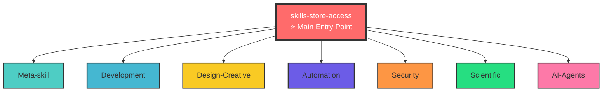

<div align="center">

# ⭐ Skills Librairie ⭐

**Organized • Intelligent • Platform-Agnostic**

> **The main entry point**: `skills-store-access` - Equip any AI with Skills store capabilities

[]()
[]()
[]()
[](./QUICK_START.md)



---

</div>

A comprehensive, organized collection of Claude skills with intelligent discovery and management capabilities. This repository is **built around the skills-store-access skill** as the **main piece** and foundation, enabling AI agents to efficiently discover, install, and manage skills across **any platform**.

**⭐ Main Entry Point**: [`Skills/Meta-skill/skills-store-access/`](./Skills/Meta-skill/skills-store-access/) - The foundational skill that works with **any system** supporting Claude skills.

**🚀 Quick Start**: See [QUICK_START.md](./QUICK_START.md) for ready-to-use prompts to equip any AI with Skills Librairie.

**⚡ Recommended Prompt** (copy-paste ready): See [COPY_THIS_PROMPT.txt](./COPY_THIS_PROMPT.txt)

**Key Features:**
- 🔄 **Platform-Agnostic** - Works with Claude Code, Claude.ai, Claude API, and any system
- 🎯 **Intelligent Discovery** - Lightweight skill discovery (90%+ context reduction)
- 🚀 **Proactive Installation** - Installs skills for ongoing projects automatically
- 📁 **Organized Structure** - Maintains clean `/Skills` directory by category
- 🔧 **Complete Lifecycle** - Create, search, install, update, sync skills

## 🎯 Getting Started: Skills Store Access

**⭐ THE MAIN PIECE - Foundation of This Repository**

This repository is built around the **[skills-store-access](./Skills/Meta-skill/skills-store-access/)** skill, which serves as the **foundational entry point** and gateway to the entire Skills store. It is the **main piece** that enables everything else in this repository.

**This skill works with ANY system** that supports Claude skills:

- **Equip itself** with Skills store capabilities (platform-aware installation)
- **Discover** relevant skills for tasks (lightweight, no context bloat)
- **Install** skills proactively when needed (intelligent decision-making)
- **Manage** skills lifecycle (create, search, update, sync across platforms)

**Key Differentiator**: Unlike other skill management systems, this provides **intelligent discovery** that doesn't fill context, **proactive installation** for ongoing projects, and **platform-agnostic** operation that works everywhere.

### Quick Start: Equip Any System with Skills Store Access

**Universal Compatibility**: The **skills-store-access** skill works with **any system** that supports Claude skills. It automatically detects your platform and adapts accordingly - no manual configuration needed.

**How It Works with Any System:**

1. **Platform Detection** - Automatically identifies your system (Codex/Cursor, Claude.ai, API, etc.)
2. **Adaptive Installation** - Uses the appropriate method for your platform
3. **Unified Interface** - Same scripts and workflows work everywhere
4. **Cross-Platform Discovery** - Discovery system works identically across platforms
5. **No Configuration** - Just install and use, it adapts automatically

**Installation for any system:**

#### For Claude Code / Cursor (Codex)

```bash
# Install skills-store-access to enable Skills store
python3 ~/.codex/skills/.system/skill-installer/scripts/install-skill-from-github.py \
  --url https://github.com/GuillaumeBld/Skills_librairie/tree/main/Skills/Meta-skill/skills-store-access

# Or use the equip script (auto-detects platform)
bash Skills/Meta-skill/skills-store-access/scripts/equip-skills-store.sh
```

Once installed, restart your IDE. The AI can now access the Skills store.

#### For Claude.ai (Web Interface)

1. Clone or download this repository
2. Navigate to `Skills/Meta-skill/skills-store-access/`
3. Zip the directory: `zip -r skills-store-access.zip .`
4. Go to [Claude.ai](https://claude.ai) → Settings → Skills
5. Upload the `skills-store-access.zip` file
6. The AI can now use the Skills store capabilities

#### For Claude API (Programmatic)

```bash
# Upload skill via API
curl -X POST https://api.anthropic.com/v1/skills \
  -H "x-api-key: YOUR_API_KEY" \
  -H "anthropic-version: 2023-06-01" \
  -F "skill=@skills-store-access.zip"

# Use skill_id in subsequent API requests
# See: https://docs.anthropic.com/en/api/skills-guide
```

#### For Any Platform

The **skills-store-access** skill is **platform-agnostic** and adapts automatically:

```bash
# Run platform detection
python3 Skills/Meta-skill/skills-store-access/scripts/detect-platform.py

# Platform-aware installation
bash Skills/Meta-skill/skills-store-access/scripts/equip-skills-store.sh

# Verify installation
python3 Skills/Meta-skill/skills-store-access/scripts/verify-installation.py
```

**Supported Platforms (Tested and Verified):**
- ✅ **Claude Code / Cursor (Codex)** - Full support, platform detection, local scripts
- ✅ **Claude.ai (Web Interface)** - Full support, web UI upload, server-side skills
- ✅ **Claude API (Programmatic)** - Full support, API endpoints, skill IDs
- ✅ **Any System Supporting Claude Skills** - Auto-detects and adapts automatically

**Platform-Specific Details:**
- See [Platform Guide](./Skills/Meta-skill/skills-store-access/references/platform-guide.md) for detailed instructions per platform
- See [Complete Solution Guide](./Skills/Meta-skill/skills-store-access/references/complete-solution-guide.md) for how discovery works with any system

## 🔍 How Skills Store Access Works with Any System

### Intelligent Discovery Without Context Bloat

The **skills-store-access** skill implements a lightweight discovery system that works efficiently across platforms:

1. **Task Analysis**: Analyzes query complexity and domain to determine if skills are needed
2. **Lightweight Search**: Searches a minimal index (~10KB) instead of full catalog (~200KB)
3. **Proactive Installation**: Installs skills when beneficial (ongoing projects, high relevance)
4. **Automatic Triggering**: Leverages Claude's built-in system for installed skills

### Example Workflow

```
User: "I need to deploy a Docker stack with Traefik"

AI with skills-store-access:
1. Analyzes task → Complexity: 0.75, Domain: devops → Skills needed
2. Discovers → Finds "vps-deployment-stack" (relevance: 0.92)
3. Checks → Already installed? If not, installs it
4. Uses → Skill triggers automatically via Claude's built-in system
```

**No manual catalog loading required** - the system handles everything efficiently.

### Key Features

- **Platform-Aware**: Auto-detects and adapts to any platform
- **Context-Efficient**: Lightweight discovery (90%+ reduction vs full catalog)
- **Intelligent**: Only searches when complexity/domain suggests skills needed
- **Proactive**: Installs skills for ongoing projects automatically
- **Self-Sufficient**: Complete lifecycle management (discover → install → use → update)

**See**: 
- [Skills Store Access Documentation](./Skills/Meta-skill/skills-store-access/SKILL.md) - Complete usage guide
- [Using with Any System](./Skills/Meta-skill/skills-store-access/references/any-system-usage.md) - Platform-agnostic guide
- [Platform Guide](./Skills/Meta-skill/skills-store-access/references/platform-guide.md) - Platform-specific details

## 📁 Repository Structure: Built Around skills-store-access

**This repository is organized around the `/Skills` directory structure**, with **skills-store-access** serving as the main entry point. The structure is maintained for organization and discoverability:

**Key Principle**: 
- ✅ **skills-store-access** is the **foundational entry point** (main piece)
- ✅ All other skills are organized by category in `/Skills` directory
- ✅ Structure remains consistent for easy navigation and discovery

```
Skills_librairie/
├── README.md                          # This file - repository overview
├── catalog.json                       # Auto-generated skill catalog (full metadata)
├── skills-index.json                  # Lightweight index for discovery (~10KB)
├── .gitignore                         # Git ignore rules
│
└── Skills/                            # All skills organized by category
    ├── Meta-skill/                    # Skills for managing skills and foundational workflows
    │   ├── skills-store-access/       # ⭐ MAIN ENTRY POINT - Equip AI with Skills store
    │   │   ├── SKILL.md               # Complete usage guide
    │   │   ├── scripts/               # Platform-aware installation & discovery
    │   │   │   ├── equip-skills-store.sh
    │   │   │   ├── detect-platform.py
    │   │   │   ├── discover-skills.py
    │   │   │   ├── analyze-task-requirements.py
    │   │   │   └── verify-installation.py
    │   │   └── references/            # Strategy guides
    │   │       ├── skill-discovery-strategy.md
    │   │       ├── platform-guide.md
    │   │       └── complete-solution-guide.md
    │   │
    │   ├── skill-library-manager/     # Skill lifecycle management
    │   │   ├── scripts/
    │   │   │   ├── create-skill.sh    # Create new skills
    │   │   │   ├── catalog-builder.py # Generate catalog.json
    │   │   │   ├── search-skills.py   # Search catalog
    │   │   │   └── sync-library.sh    # Sync with GitHub
    │   │   └── references/
    │   │
    │   ├── superpowers/               # ⭐ Foundational workflow skill (TDD, systematic debugging)
    │   │   └── SKILL.md               # Teaches agents to use skills effectively
    │   │
    │   ├── superpowers-lab/           # Experimental superpowers skills
    │   │   └── SKILL.md               # Reference to obra/superpowers-lab
    │   │
    │   ├── skill-creator/             # Skill creation guidance
    │   └── skill-quality-auditor/     # Quality assurance
    │
    ├── Automation/                    # Workflow automation
    │   ├── n8n-workflow-patterns/
    │   ├── n8n-expression-syntax/
    │   ├── n8n-code-javascript/
    │   ├── n8n-code-python/
    │   ├── n8n-mcp-tools-expert/
    │   ├── n8n-node-configuration/
    │   └── n8n-validation-expert/
    │
    ├── Infrastructure-DevOps/         # DevOps and infrastructure
    │   ├── vps-deployment-stack/
    │   ├── vps-daily-operations/
    │   └── docker-development-workflow/
    │
    ├── Development/                   # Development tools and workflows
    │   ├── mcp-builder/
    │   ├── web-artifacts-builder/
    │   ├── webapp-testing/
    │   ├── ios-simulator-skill/       # iOS app building and testing
    │   └── playwright-skill/          # Browser automation with Playwright
    │
    ├── Design-Creative/               # Design and creative
    │   ├── canvas-design/
    │   ├── frontend-design/
    │   ├── algorithmic-art/
    │   ├── theme-factory/
    │   ├── slack-gif-creator/
    │   ├── claude-d3js-skill/
    │   └── web-asset-generator/
    │
    ├── Communication/                 # Communication and branding
    │   ├── internal-comms/
    │   ├── brand-guidelines/
    │   └── doc-coauthoring/
    │
    ├── Document-Generation/           # Document creation
    │   ├── docx/
    │   ├── pdf/
    │   ├── pptx/
    │   └── xlsx/
    │
    ├── AI-Agents/                     # AI agent workflows
    │   ├── rag-pipeline-expert/
    │   └── loki-mode/
    │
    ├── Security/                      # Security and penetration testing
    │   └── ffuf-web-fuzzing/
    │
    └── Scientific/                    # Scientific computing and data analysis
        └── claude-scientific-skills/
```

**Key Points:**
- **`Skills/` directory** (capital S) contains all skills organized by category
- **`skills-store-access`** is the main entry point in `Skills/Meta-skill/`
- Each skill is self-contained with `SKILL.md` and optional resources
- `catalog.json` is auto-generated at repository root
- `skills-index.json` is lightweight index for discovery (~10KB)

## 🚀 Usage: How to Use Skills Store Access with Any System

### Step 1: Equip the System

**For Claude Code / Cursor:**
```bash
# Method 1: Using skill-installer (recommended)
python3 ~/.codex/skills/.system/skill-installer/scripts/install-skill-from-github.py \
  --url https://github.com/GuillaumeBld/Skills_librairie/tree/main/Skills/Meta-skill/skills-store-access

# Method 2: Using equip script (auto-detects platform)
bash Skills/Meta-skill/skills-store-access/scripts/equip-skills-store.sh

# Restart IDE after installation
```

**For Claude.ai:**
1. Clone repository: `gh repo clone GuillaumeBld/Skills_librairie`
2. Navigate to: `Skills/Meta-skill/skills-store-access/`
3. Zip directory: `zip -r skills-store-access.zip .`
4. Upload via Claude.ai UI: Settings → Skills → Upload Skill

**For Claude API:**
- Upload skill via API endpoints (see Anthropic API docs)
- Use returned `skill_id` in API requests with `skill_ids` parameter

### Step 2: Generate Discovery Index

```bash
cd Skills_librairie

# Generate lightweight index for efficient discovery
python3 Skills/Meta-skill/skills-store-access/scripts/generate-skills-index.py

# This creates: skills-index.json (~10KB for 100+ skills)
# Much lighter than catalog.json (90%+ size reduction)
```

### Step 3: Use Discovery Capabilities

Once equipped, the AI can intelligently discover and use skills:

```bash
# Example: Discover skills for a task
python3 Skills/Meta-skill/skills-store-access/scripts/discover-skills.py "docker traefik deployment"

# Example: Analyze if task needs skills
python3 Skills/Meta-skill/skills-store-access/scripts/analyze-task-requirements.py \
  "I need to build a RAG pipeline" --ongoing
```

### Step 4: Let Skills Trigger Automatically

Once installed, skills trigger automatically via Claude's built-in system:
- Skills match based on description in SKILL.md frontmatter
- No manual "calling" needed - Claude handles it automatically
- Installed skill metadata is already in context (~30-100 tokens per skill)

## 📚 Skill Categories

### Meta-skill
Skills for managing and creating skills themselves, and foundational workflows:
- **skills-store-access** ⭐ - Main entry point, equips AI with Skills store
- **skill-library-manager** - Lifecycle management (create, search, update, sync)
- **superpowers** ⭐ - Foundational skill that teaches agents how to use skills to their best capabilities (TDD, systematic debugging, collaborative planning)
- **superpowers-lab** - Experimental skills from superpowers lab (new techniques being refined)
- **skill-creator** - Guidance for creating effective skills
- **skill-quality-auditor** - Quality assurance tools

### Automation
Workflow automation, especially n8n:
- n8n-workflow-patterns
- n8n-expression-syntax
- n8n-code-javascript / n8n-code-python
- n8n-mcp-tools-expert
- n8n-node-configuration
- n8n-validation-expert

### Infrastructure-DevOps
DevOps, deployment, and infrastructure management:
- vps-deployment-stack
- vps-daily-operations
- docker-development-workflow

### Development
Development tools and workflows:
- mcp-builder
- web-artifacts-builder
- webapp-testing
- **ios-simulator-skill** - iOS app building, navigation, and testing through automation (semantic navigation)
- **playwright-skill** - General-purpose browser automation using Playwright for UI verification

### Design-Creative
Design, creative, and visual skills:
- canvas-design
- frontend-design
- algorithmic-art
- theme-factory
- slack-gif-creator
- **claude-d3js-skill** - Create data visualizations using d3.js for interactive charts and graphs
- **web-asset-generator** - Generates web assets like favicons, app icons, and social media images

### Communication
Communication, branding, and documentation:
- internal-comms
- brand-guidelines
- doc-coauthoring

### Document-Generation
Document creation and manipulation:
- docx (Word documents)
- pdf (PDF processing)
- pptx (PowerPoint)
- xlsx (Excel)

### AI-Agents
AI agent workflows and RAG:
- rag-pipeline-expert
- **loki-mode** - Multi-agent autonomous startup system (orchestrates 37 AI agents across 6 swarms)

### Security
Security testing and penetration testing skills:
- **ffuf-web-fuzzing** - Expert guidance for ffuf web fuzzing during penetration testing

### Scientific
Scientific computing and data analysis skills:
- **claude-scientific-skills** - Comprehensive collection of ready-to-use scientific skills, including specialized scientific libraries and databases

## 🔧 System Requirements

### For skills-store-access (Platform-Agnostic)

**Minimum Requirements:**
- Python 3.8+ (for discovery scripts)
- Git (for repository operations)
- Access to Skills_librairie repository

**Optional (Recommended):**
- GitHub CLI (`gh`) - For easier GitHub operations
- Claude Code/Cursor - For development-friendly installation

**Platform-Specific:**
- **Claude Code/Cursor**: Uses `~/.codex/skills/` directory
- **Claude.ai**: Uses web UI for skill upload
- **Claude API**: Uses API endpoints for skill management

### For Repository Management

- GitHub CLI (`gh`) - For authentication and repository operations
- Python 3.8+ with PyYAML - For catalog operations
- Git - For version control

## 📖 Documentation

### Core Documentation

- **[Skills Store Access](./Skills/Meta-skill/skills-store-access/SKILL.md)** - Complete guide to equipping AI with Skills store
- **[Skill Discovery Strategy](./Skills/Meta-skill/skills-store-access/references/skill-discovery-strategy.md)** - When and how to discover skills
- **[Platform Guide](./Skills/Meta-skill/skills-store-access/references/platform-guide.md)** - Platform-specific instructions
- **[Complete Solution Guide](./Skills/Meta-skill/skills-store-access/references/complete-solution-guide.md)** - Complete discovery solution

### Skill Library Manager

- **[Skill Library Manager](./Skills/skill-library-manager/SKILL.md)** - Managing skills in this repository
- **[Catalog Builder](./Skills/skill-library-manager/scripts/catalog-builder.py)** - Generate catalog.json
- **[Search Skills](./Skills/skill-library-manager/scripts/search-skills.py)** - Search catalog

### Additional Resources

- **[Skill Creator Guide](./Skills/Meta-skill/skill-creator/SKILL.md)** - Creating effective skills
- **[Skill Template](./Skills/skill-library-manager/references/skill-template.md)** - Template for new skills

## 🌐 How This Skill Works with Any System

The **skills-store-access** skill is **platform-agnostic** and designed to work with **any system** that supports Claude skills. It automatically adapts to your environment without manual configuration.

### System Detection and Adaptation

The skill includes intelligent platform detection that:

1. **Detects Platform**: Automatically identifies your system (Codex/Cursor, Claude.ai, API, etc.)
2. **Adapts Installation**: Uses the appropriate installation method for your platform
3. **Verifies Setup**: Ensures installation worked correctly
4. **Tests Functionality**: Verifies all capabilities are available

### Universal Compatibility

Whether you're using:

**Claude Code / Cursor (Codex)**
- Installation: Uses skill-installer or manual copy to `~/.codex/skills/`
- Discovery: Scripts run locally, search local repository  
- Skills: Installed locally, auto-trigger via description matching
- **Works out of the box** - Full feature support

**Claude.ai (Web Interface)**
- Installation: Upload skill via web UI (Settings → Skills)
- Discovery: Skills stored on Anthropic servers, accessed via UI
- Skills: Triggered automatically based on description match
- **Works out of the box** - Full feature support

**Claude API (Programmatic)**
- Installation: Upload via API endpoints, receive skill_id
- Discovery: Skills referenced by skill_id in API requests
- Skills: Included in requests via `skill_ids` parameter
- **Works out of the box** - Full feature support

**Any Other System**
- Platform Detection: Auto-detects platform and capabilities
- Adaptive Installation: Uses appropriate method for platform
- Unified Interface: Same discovery scripts work across platforms
- **Works out of the box** - Auto-adapts to environment

### How to Use with Your System

**Step 1: Install skills-store-access**
```bash
# Platform detection and installation happen automatically
bash Skills/Meta-skill/skills-store-access/scripts/equip-skills-store.sh
```

**Step 2: Verify Installation**
```bash
# Works on any platform
python3 Skills/Meta-skill/skills-store-access/scripts/verify-installation.py
```

**Step 3: Start Using**
- Discovery works the same across all platforms
- Same scripts, same interface, same capabilities
- System-specific adaptations happen automatically

**No system-specific configuration needed** - it just works!

## 🔄 Workflows

### Workflow 1: Equip Any System with Skills Store

```bash
# 1. Clone repository
gh repo clone GuillaumeBld/Skills_librairie
cd Skills_librairie

# 2. Install skills-store-access (platform-aware)
bash Skills/Meta-skill/skills-store-access/scripts/equip-skills-store.sh

# 3. Verify installation
python3 Skills/Meta-skill/skills-store-access/scripts/verify-installation.py

# 4. Generate discovery index
python3 Skills/Meta-skill/skills-store-access/scripts/generate-skills-index.py

# System is now equipped!
```

### Workflow 2: Discover and Install Skills

```bash
# 1. Analyze task requirements
python3 Skills/Meta-skill/skills-store-access/scripts/analyze-task-requirements.py \
  "I need to deploy a Docker stack" --ongoing

# 2. Discover relevant skills (if needed)
python3 Skills/Meta-skill/skills-store-access/scripts/discover-skills.py \
  "docker traefik deployment" --min-relevance 0.7

# 3. Install discovered skills (via skill-library-manager)
bash Skills/skill-library-manager/scripts/create-skill.sh  # For creating new skills
# Or use skill-installer for existing skills

# Skills will trigger automatically once installed
```

### Workflow 3: Create and Manage Skills

```bash
# 1. Create new skill
cd Skills_librairie
bash Skills/skill-library-manager/scripts/create-skill.sh

# 2. Search existing skills
python3 Skills/skill-library-manager/scripts/search-skills.py "database"

# 3. Update catalog
python3 Skills/skill-library-manager/scripts/catalog-builder.py

# 4. Regenerate discovery index
python3 Skills/Meta-skill/skills-store-access/scripts/generate-skills-index.py

# 5. Sync with GitHub
bash Skills/skill-library-manager/scripts/sync-library.sh
```

## 🎯 Key Features

### Intelligent Discovery
- **Lightweight Index**: ~10KB for 100+ skills (90%+ reduction vs catalog)
- **Context-Efficient**: Only searches when complexity/domain suggests skills needed
- **Relevance Scoring**: Returns top matches with confidence scores
- **No Context Bloat**: Never loads heavy catalogs into context

### Proactive Installation
- **Smart Detection**: Analyzes task complexity and domain
- **Ongoing Projects**: Installs skills for multi-step workflows
- **High Relevance**: Installs when skill relevance > 0.7
- **Cost-Benefit**: Only installs when beneficial

### Platform-Agnostic
- **Auto-Detection**: Detects platform automatically
- **Adaptive Installation**: Uses appropriate method per platform
- **Unified Interface**: Same scripts work everywhere
- **Cross-Platform**: Works with Claude Code, Claude.ai, API, and more

### Complete Lifecycle Management
- **Create**: Automated skill creation workflow
- **Search**: Lightweight discovery and search
- **Install**: Platform-aware installation
- **Update**: Version management and updates
- **Sync**: GitHub synchronization

## 📝 Contributing

### Adding New Skills

1. Use skill-creator guidance: `Skills/Meta-skill/skill-creator/SKILL.md`
2. Follow structure: `Skills/<Category>/<skill-name>/SKILL.md`
3. Update catalog: `python3 Skills/skill-library-manager/scripts/catalog-builder.py`
4. Regenerate index: `python3 Skills/Meta-skill/skills-store-access/scripts/generate-skills-index.py`
5. Commit and push: Follow Git workflow

### Categories

Skills are organized into these categories:
- **Meta-skill**: Skills about managing skills and foundational workflows (superpowers, skills-store-access, skill-library-manager)
- **Automation**: Workflow automation (n8n, etc.)
- **Infrastructure-DevOps**: DevOps, deployment, infrastructure
- **Development**: Development tools and workflows (mcp-builder, ios-simulator-skill, playwright-skill)
- **Design-Creative**: Design and creative skills (canvas-design, claude-d3js-skill, web-asset-generator)
- **Communication**: Communication, branding, docs
- **Document-Generation**: Document creation (PDF, DOCX, PPTX, XLSX)
- **AI-Agents**: AI agent workflows (RAG, loki-mode)
- **Security**: Security testing and penetration testing (ffuf-web-fuzzing)
- **Scientific**: Scientific computing and data analysis (claude-scientific-skills)

## 🔗 Resources

### External Documentation
- [What are skills?](https://support.claude.com/en/articles/12512176-what-are-skills)
- [Using skills in Claude](https://support.claude.com/en/articles/12512180-using-skills-in-claude)
- [Creating custom skills](https://support.claude.com/en/articles/12512198-creating-custom-skills)
- [Agent Skills Specification](http://agentskills.io)
- [Claude Skills API Guide](https://docs.claude.com/en/api/skills-guide)

### Community Resources
- **[Awesome Claude Skills](https://github.com/travisvn/awesome-claude-skills)** - Comprehensive curated list of Claude Skills, resources, and tools
  - Excellent reference for understanding the Skills ecosystem
  - Includes comparisons of Skills vs Prompts, Projects, Subagents, MCP
  - Security best practices and troubleshooting guides
  - **Note**: Skills Librairie could be added to this list in the "Collections & Libraries" section

### Repository
- **GitHub**: https://github.com/GuillaumeBld/Skills_librairie
- **Main Entry Point**: `Skills/Meta-skill/skills-store-access/`
- **Documentation**: See `Skills/` directory for individual skill docs

## ⚡ Quick Reference

**Equip Any System:**
```bash
bash Skills/Meta-skill/skills-store-access/scripts/equip-skills-store.sh
```

**Discover Skills:**
```bash
python3 Skills/Meta-skill/skills-store-access/scripts/discover-skills.py "your query"
```

**Analyze Task:**
```bash
python3 Skills/Meta-skill/skills-store-access/scripts/analyze-task-requirements.py "task description"
```

**Create Skill:**
```bash
bash Skills/skill-library-manager/scripts/create-skill.sh
```

**Search Skills:**
```bash
python3 Skills/skill-library-manager/scripts/search-skills.py "keyword"
```

## 📄 License

Most skills in this repository are licensed under MIT. Some skills may have different licenses - check individual skill directories for license information.

## 🔄 Comparison with Other Skill Systems

### Similar Systems & Resources

This repository follows similar principles to other skill systems and resources:

**Collections & Libraries:**
- **[Superpowers](https://github.com/obra/superpowers)** - Comprehensive skills library for Claude Code with structured development workflows
  - **[Superpowers Lab](https://github.com/obra/superpowers-lab)** - Experimental skills repository for testing new skills before integration
- **[OpenAI Skills](https://github.com/openai/skills)** - Official skills repository from OpenAI

**Curated Lists & Directories:**
- **[Awesome Claude Skills](https://github.com/travisvn/awesome-claude-skills)** - Comprehensive curated list of Claude Skills, resources, and tools
  - Excellent reference for understanding the Skills ecosystem
  - Includes comparisons of Skills vs Prompts, Projects, Subagents, MCP
  - Security best practices and troubleshooting guides

### How This Differs

**Skills Librairie** focuses on:
- **Platform-Agnostic Design** - Works with Claude Code, Claude.ai, API, and any system (not just Claude Code)
- **Unified Repository** - All skills (stable and experimental) in one organized repository with category structure
- **Intelligent Discovery** - Lightweight discovery system (90%+ context reduction) with proactive installation
- **Complete Lifecycle Management** - Create, search, install, update, sync all in one place
- **skills-store-access as Foundation** - Main entry point that works with any system

**Key Differences from Superpowers Ecosystem:**
- **Single Repository vs Two** - Superpowers uses separate repos (production + lab), we use one organized repo with categories
- **Platform Scope** - Superpowers is Claude Code-focused, we support any system (Claude Code, Claude.ai, API, etc.)
- **Discovery Method** - Superpowers uses marketplace/plugin system, we use lightweight index + proactive installation
- **Entry Point** - Superpowers uses plugin marketplace, we use skills-store-access skill (self-installing)

**Key Advantages:**
- ✅ **Any System Support** - Not limited to Claude Code
- ✅ **Context-Efficient** - Lightweight discovery without loading full catalogs
- ✅ **Proactive Installation** - Installs skills for ongoing projects automatically
- ✅ **Organized by Category** - Clear structure in `/Skills` directory (no separate lab repo needed)
- ✅ **Self-Sufficient** - Complete workflow from discovery to installation to management
- ✅ **Unified Management** - One repository for all skills, organized by category and maturity

**How This Differs from Awesome Lists:**
- **Awesome Claude Skills** is a curated *directory/index* of skills (like awesome-python, awesome-javascript)
- **Skills Librairie** is an actual *skill repository* with organized skills you can install and use
- Awesome lists catalog and link to resources; Skills Librairie provides the actual skills with intelligent discovery

### Can Be Used Together

Skills from this repository can be used alongside:
- Superpowers skills (both can coexist)
- OpenAI curated skills
- Custom skills
- Other skill repositories
- Skills listed in [Awesome Claude Skills](https://github.com/travisvn/awesome-claude-skills)

**No conflicts** - Each skill system works independently. Skills Librairie complements curated lists like Awesome Claude Skills by providing an actual skill repository with built-in discovery and management capabilities.

## 🙏 Acknowledgments

This repository builds on:
- Anthropic's Claude Skills system and documentation
- The Agent Skills specification ([agentskills.io](http://agentskills.io))
- Inspiration from [Superpowers](https://github.com/obra/superpowers) for structured skill workflows
- [OpenAI Skills](https://github.com/openai/skills) for skill organization patterns
- [Awesome Claude Skills](https://github.com/travisvn/awesome-claude-skills) for comprehensive ecosystem documentation
- Community contributions and feedback

**Note:** This repository could be added to the [Awesome Claude Skills](https://github.com/travisvn/awesome-claude-skills) curated list in the "Collections & Libraries" section.

## 🏗️ Architecture: Built Around skills-store-access

### The Foundation

This repository is architected with **skills-store-access** as the **main piece** and foundation:

```
┌─────────────────────────────────────────────────────────────┐
│              skills-store-access (FOUNDATION)                │
│  ┌───────────────────────────────────────────────────────┐  │
│  │  Platform-Aware Installation                          │  │
│  │  Intelligent Discovery (lightweight, no context)      │  │
│  │  Proactive Installation (ongoing projects)            │  │
│  │  Cross-Platform Compatibility (any system)            │  │
│  └───────────────────────────────────────────────────────┘  │
└─────────────────────────────────────────────────────────────┘
                          │
                          │ Enables
                          ▼
┌─────────────────────────────────────────────────────────────┐
│                    Skills Store Repository                   │
│  ┌───────────────────────────────────────────────────────┐  │
│  │  skill-library-manager (Lifecycle Management)         │  │
│  │    ├── Create skills                                  │  │
│  │    ├── Search skills                                  │  │
│  │    ├── Update skills                                  │  │
│  │    └── Sync with GitHub                               │  │
│  └───────────────────────────────────────────────────────┘  │
│  ┌───────────────────────────────────────────────────────┐  │
│  │  Skills/ Directory (Organized by Category)            │  │
│  │    ├── Meta-skill/     (Managing skills)              │  │
│  │    ├── Automation/     (n8n, workflows)               │  │
│  │    ├── Infrastructure/ (DevOps, deployment)           │  │
│  │    ├── Development/    (Tools, testing)               │  │
│  │    ├── Design-Creative/ (UI/UX, themes)              │  │
│  │    ├── Communication/  (Branding, docs)               │  │
│  │    ├── Document-Gen/   (PDF, DOCX, PPTX, XLSX)        │  │
│  │    └── AI-Agents/      (RAG, AI workflows)            │  │
│  └───────────────────────────────────────────────────────┘  │
└─────────────────────────────────────────────────────────────┘
```

**Key Architecture Principles:**

1. **skills-store-access is the Foundation** - All other capabilities build on this
2. **Maintains /Skills Structure** - Categories organized in `/Skills` directory
3. **Platform-Agnostic Design** - Works with any system supporting Claude skills
4. **Lightweight Discovery** - Doesn't fill context, uses minimal index
5. **Progressive Disclosure** - Leverages Claude's built-in 3-level system

### How It Works with Any System

**Universal Design Pattern:**

```
Any System → skills-store-access → Skills Store → All Skills
    │              │                    │              │
    │              │                    │              │
    ├─ Detects ────┘                    │              │
    │              │                    │              │
    ├─ Installs ───┴─ Platform-Aware ──┘              │
    │              │                    │              │
    ├─ Discovers ──┴─ Lightweight ─────┴─ Index ──────┘
    │              │                    │              │
    └─ Uses ───────┴─ Auto-Triggers ────┴──────────────┘
```

**Cross-Platform Flow:**
1. **Install**: Platform-aware installation (auto-detects method)
2. **Discover**: Lightweight search (skills-index.json, not catalog.json)
3. **Install Skills**: Proactive installation when beneficial
4. **Use**: Skills auto-trigger via Claude's built-in system

**No System-Specific Code Required** - Same workflow everywhere!

---

**⭐ Start Here**: Install [skills-store-access](./Skills/Meta-skill/skills-store-access/) to equip any AI system with complete Skills store capabilities!

**📖 Documentation**: 
- [Complete Skills Store Access Guide](./Skills/Meta-skill/skills-store-access/SKILL.md)
- [How It Works with Any System](./Skills/Meta-skill/skills-store-access/references/platform-guide.md)
- [Discovery Strategy](./Skills/Meta-skill/skills-store-access/references/skill-discovery-strategy.md)
