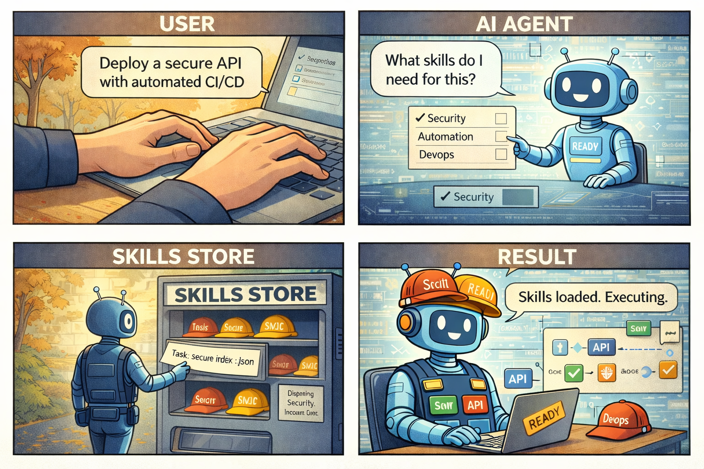
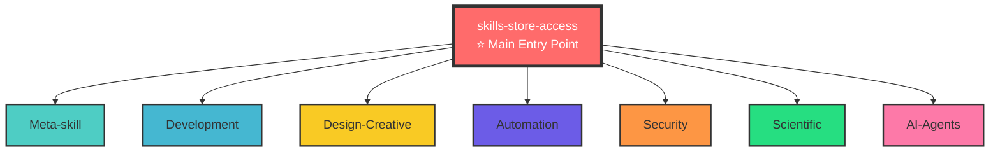

<div align="center">

# ⭐ Welcome to Skills Store ⭐

**Empower Any AI with 40+ Skills • Intelligent Discovery • Works Everywhere**

> Transform your AI into a specialized agent with curated skills for development, automation, design, and more!

[]()
[]()
[]()
[](./QUICK_START.md)

</div>

## 🚀 Get Started in 30 Seconds

**Equip any AI system (Claude Code, Claude.ai, Claude API, or any platform) with Skills store capabilities:**

<details>
  <summary><strong>Option 1, copy and paste this prompt into your AI (click to expand)</strong></summary>

```text
Read these skills and equip yourself with Skills Librairie capabilities:

1. https://raw.githubusercontent.com/GuillaumeBld/Skills_librairie/main/Skills/Meta-skill/skills-store-access/SKILL.md
2. https://raw.githubusercontent.com/GuillaumeBld/Skills_librairie/main/Skills/Meta-skill/superpowers/SKILL.md

The first gives you access to the Skills store with intelligent discovery and JAAT-enhanced auto-discovery capabilities, the second teaches you how to use skills to their best capabilities (TDD, systematic debugging, collaborative planning).

Note: If the superpowers skill URL returns 404, it means it hasn't been pushed to GitHub yet. In that case:
- Use skills-store-access first to equip yourself with Skills store capabilities
- The superpowers skill will be available once pushed, or you can read it from the cloned repository locally

Repository: https://github.com/GuillaumeBld/Skills_librairie

After reading both skills (or just skills-store-access if superpowers isn't available yet):

1. Clone the repository (if not already done):
   git clone https://github.com/GuillaumeBld/Skills_librairie.git <your-path>/Skills_librairie
   cd <your-path>/Skills_librairie

2. Set LIBRARY_ROOT environment variable (optional, but recommended):
   export LIBRARY_ROOT="<your-path>/Skills_librairie"
   The scripts will auto-detect the library root by walking up from their location, but setting this explicitly helps.

3. Build the catalog (generates catalog.json from all skills):
   python3 Skills/skill-library-manager/scripts/catalog-builder.py
   This script:
   - Auto-detects LIBRARY_ROOT if not set
   - Finds the Skills/ directory (capital S)
   - Scans recursively through all category subdirectories
   - Extracts metadata from each SKILL.md file
   - Generates catalog.json with all skills and categories

4. Generate the lightweight skills discovery index:
   python3 Skills/Meta-skill/skills-store-access/scripts/generate-skills-index.py
   This creates skills-index.json for efficient skill discovery.

5. Verify installation by searching for skills:
   python3 Skills/skill-library-manager/scripts/search-skills.py --all

6. Confirm understanding of superpowers methodology for systematic workflows (if available).

Optional: Enable JAAT-Enhanced Discovery (for advanced auto-discovery):
# Install JAAT dependencies for enhanced skill extraction
pip install -r Skills/Meta-skill/skills-store-access/requirements.txt

# Test JAAT-enhanced workflow
python3 Skills/Meta-skill/skills-store-access/scripts/test-jaat-workflow.py \
  "Deploy Docker stack with database migrations" \
  --use-jaat

Key Features Available:
- Intelligent skill discovery (90%+ context reduction)
- JAAT-enhanced extraction (O*NET tasks + EuropaCode skills)
- Automatic skill gap detection
- Auto-creation of missing skills from authoritative sources
- Proactive installation for ongoing projects

Important Notes:
- The repository uses Skills/ (capital S) directory, not skills/ (lowercase)
- Skills are organized in categories: Skills/Meta-skill/, Skills/Development/, etc.
- The scripts automatically handle case sensitivity and path detection
- If you cloned to a non-standard location, set LIBRARY_ROOT to help the scripts find it
- JAAT features are optional, the skill works without them using keyword-based discovery

If you're reading this locally (repository cloned), you can read superpowers from:
- Local path: Skills/Meta-skill/superpowers/SKILL.md
```
</details>

  <summary><strong>Option 2: Clone and install locally</summary></strong>
git clone https://github.com/GuillaumeBld/Skills_librairie.git
cd Skills_librairie
bash Skills/Meta-skill/skills-store-access/scripts/equip-skills-store.sh
```


**That's it!** Your AI can now discover, install, and use 40+ specialized skills automatically. ✨

---

## How It Works

See how the intelligent skill discovery system works from user request to execution:



*The four-panel workflow: (1) User makes a request → (2) AI analyzes and identifies needed skills → (3) Skills Store provides or auto-creates skills → (4) AI executes the task with acquired capabilities*

## Skills Architecture



---

## What You Get

**Skills Librairie** is a comprehensive, organized collection of Claude skills that enables AI agents to efficiently discover, install, and manage specialized capabilities across **any platform**.

### Key Features

- **Intelligent Discovery** - Lightweight skill discovery (90%+ context reduction) that finds exactly what you need
- **Auto-Creation** - Missing skills? The system can create them automatically from authoritative sources (JAAT-enhanced)
- **Platform-Agnostic** - Works with Claude Code, Claude.ai, Claude API, and any system supporting Claude skills
- **40+ Ready Skills** - Organized across 11 categories: Development, Automation, Design, DevOps, and more
- **Proactive Installation** - Installs skills automatically for ongoing projects when beneficial
- **Organized Structure** - Clean, category-based organization for easy navigation

## How to Equip Any AI System

The **skills-store-access** skill automatically detects your platform and works everywhere - no configuration needed!

### Option 1: Quick Install (Recommended)

**For Claude Code / Cursor:**
```bash
# Clone the repository
git clone https://github.com/GuillaumeBld/Skills_librairie.git
cd Skills_librairie

# Run the equip script (auto-detects your platform)
bash Skills/Meta-skill/skills-store-access/scripts/equip-skills-store.sh

# Restart your IDE, and you're done! ✨
```

**For Claude.ai (Web Interface):**
1. Clone: `git clone https://github.com/GuillaumeBld/Skills_librairie.git`
2. Navigate: `cd Skills_librairie/Skills/Meta-skill/skills-store-access/`
3. Zip: `zip -r skills-store-access.zip .`
4. Upload: Go to [Claude.ai](https://claude.ai) → Settings → Skills → Upload `skills-store-access.zip`

**For Claude API:**
```bash
# Upload via API (see Anthropic docs for details)
# Then use skill_id in API requests
```

### Option 2: Use the Copy-Paste Prompt

Simply copy the content from [`COPY_THIS_PROMPT.txt`](./COPY_THIS_PROMPT.txt) and paste it into your AI. It will equip itself automatically!

### What Happens Next?

Once equipped, your AI can:
- ✅ **Discover** relevant skills automatically when you make requests
- ✅ **Install** skills proactively for ongoing projects  
- ✅ **Use** 40+ skills across 11 categories
- ✅ **Auto-create** missing skills when needed (JAAT-enhanced)

**Platform Detection:** The system automatically detects your environment (Codex/Cursor, Claude.ai, API, etc.) and adapts accordingly. No manual configuration required!

## Installation Details (Any Platform)

### Detailed Installation Steps

<details>
<summary><b>Claude Code / Cursor (Codex) - Click to expand</b></summary>

```bash
# Method 1: Using skill-installer (if available)
python3 ~/.codex/skills/.system/skill-installer/scripts/install-skill-from-github.py \
  --url https://github.com/GuillaumeBld/Skills_librairie/tree/main/Skills/Meta-skill/skills-store-access

# Method 2: Using equip script (auto-detects platform - RECOMMENDED)
git clone https://github.com/GuillaumeBld/Skills_librairie.git
cd Skills_librairie
bash Skills/Meta-skill/skills-store-access/scripts/equip-skills-store.sh

# Restart your IDE after installation
```

</details>

<details>
<summary><b>Claude.ai (Web Interface) - Click to expand</b></summary>

1. Clone the repository:
   ```bash
   git clone https://github.com/GuillaumeBld/Skills_librairie.git
   cd Skills_librairie/Skills/Meta-skill/skills-store-access/
   ```

2. Create a zip file:
   ```bash
   zip -r skills-store-access.zip .
   ```

3. Upload to Claude.ai:
   - Go to [Claude.ai](https://claude.ai)
   - Navigate to Settings → Skills
   - Click "Upload Skill"
   - Select `skills-store-access.zip`

That's it! The AI can now use Skills store capabilities.

</details>

<details>
<summary><b>Claude API (Programmatic) - Click to expand</b></summary>

```bash
# Upload skill via API
curl -X POST https://api.anthropic.com/v1/skills \
  -H "x-api-key: YOUR_API_KEY" \
  -H "anthropic-version: 2023-06-01" \
  -F "skill=@skills-store-access.zip"

# Use the returned skill_id in subsequent API requests
# See: https://docs.anthropic.com/en/api/skills-guide
```

</details>

<details>
<summary><b>Verify Installation - Click to expand</b></summary>

After installation, verify everything works:

```bash
# Verify installation
python3 Skills/Meta-skill/skills-store-access/scripts/verify-installation.py

# Test discovery
python3 Skills/Meta-skill/skills-store-access/scripts/discover-skills.py "docker deployment"
```

</details>

**Supported Platforms (Tested and Verified):**
- ✅ **Claude Code / Cursor (Codex)** - Full support, platform detection, local scripts
- ✅ **Claude.ai (Web Interface)** - Full support, web UI upload, server-side skills
- ✅ **Claude API (Programmatic)** - Full support, API endpoints, skill IDs
- ✅ **Any System Supporting Claude Skills** - Auto-detects and adapts automatically

**Platform-Specific Details:**
- See [Platform Guide](./Skills/Meta-skill/skills-store-access/references/platform-guide.md) for detailed instructions per platform
- See [Complete Solution Guide](./Skills/Meta-skill/skills-store-access/references/complete-solution-guide.md) for how discovery works with any system

## How It Works in Practice

Once equipped, your AI automatically handles skill discovery and installation. Here's what happens:

### Simple Example: Basic Discovery

**You:** *"I need to deploy a Docker stack with Traefik"*

**Your AI (automatically):**
1. Analyzes the request → Recognizes it's a DevOps task
2. Discovers relevant skills → Finds "vps-deployment-stack" (relevance: 92%)
3. Installs if needed → Automatically installs the skill for you
4. Uses the skill → Executes your request with the right tools

**Result:** Your deployment task is handled with specialized DevOps knowledge!

### Advanced Example: JAAT-Enhanced Auto-Creation

**You:** *"Deploy a secure API with automated CI/CD and database migrations"*

**Your AI (with JAAT-enhanced discovery):**
1. Extracts standardized skills → Uses O*NET and EuropaCode taxonomies
2. Maps to catalog → Identifies existing skills + detects what's missing
3. Auto-creates missing skills → Generates new skills from authoritative sources
4. Installs everything → Sets up all required capabilities
5. Executes → Completes your complex task with newly acquired skills

**Result:** Even if skills don't exist, the system creates them automatically!

### Key Benefits

- **Zero Manual Work** - Skills are discovered and installed automatically
- **Context Efficient** - Uses lightweight index (10KB vs 200KB catalog)
- **Intelligent** - Only searches when needed, only installs when beneficial
- **Adaptive** - Works the same across all platforms
- **Proactive** - Installs skills for ongoing projects automatically

See the [visual workflow](#-how-it-works) above for a complete illustration of this process!

### Key Features

- **Platform-Aware**: Auto-detects and adapts to any platform
- **Context-Efficient**: Lightweight discovery (90%+ reduction vs full catalog)
- **Intelligent**: Only searches when complexity/domain suggests skills needed
- **Proactive**: Installs skills for ongoing projects automatically
- **Self-Sufficient**: Complete lifecycle management (discover → install → use → update)

**See**: 
- [Skills Store Access Documentation](./Skills/Meta-skill/skills-store-access/SKILL.md) - Complete usage guide
- [Using with Any System](./Skills/Meta-skill/skills-store-access/references/any-system-usage.md) - Platform-agnostic guide
- [Platform Guide](./Skills/Meta-skill/skills-store-access/references/platform-guide.md) - Platform-specific details

## 📁 Repository Structure: Built Around skills-store-access

**This repository is organized around the `/Skills` directory structure**, with **skills-store-access** serving as the main entry point. The structure is maintained for organization and discoverability:

**Key Principle**: 
- ✅ **skills-store-access** is the **foundational entry point** (main piece)
- ✅ All other skills are organized by category in `/Skills` directory
- ✅ Structure remains consistent for easy navigation and discovery

```
Skills_librairie/
├── README.md                          # This file - repository overview
├── catalog.json                       # Auto-generated skill catalog (full metadata)
├── skills-index.json                  # Lightweight index for discovery (~10KB)
├── .gitignore                         # Git ignore rules
│
└── Skills/                            # All skills organized by category
    ├── Meta-skill/                    # Skills for managing skills and foundational workflows
    │   ├── skills-store-access/       # ⭐ MAIN ENTRY POINT - Equip AI with Skills store
    │   │   ├── SKILL.md               # Complete usage guide
    │   │   ├── scripts/               # Platform-aware installation & discovery
    │   │   │   ├── equip-skills-store.sh
    │   │   │   ├── detect-platform.py
    │   │   │   ├── discover-skills.py
    │   │   │   ├── analyze-task-requirements.py
    │   │   │   └── verify-installation.py
    │   │   └── references/            # Strategy guides
    │   │       ├── skill-discovery-strategy.md
    │   │       ├── platform-guide.md
    │   │       └── complete-solution-guide.md
    │   │
    │   ├── skill-library-manager/     # Skill lifecycle management
    │   │   ├── scripts/
    │   │   │   ├── create-skill.sh    # Create new skills
    │   │   │   ├── catalog-builder.py # Generate catalog.json
    │   │   │   ├── search-skills.py   # Search catalog
    │   │   │   └── sync-library.sh    # Sync with GitHub
    │   │   └── references/
    │   │
    │   ├── superpowers/               # ⭐ Foundational workflow skill (TDD, systematic debugging)
    │   │   └── SKILL.md               # Teaches agents to use skills effectively
    │   │
    │   ├── superpowers-lab/           # Experimental superpowers skills
    │   │   └── SKILL.md               # Reference to obra/superpowers-lab
    │   │
    │   ├── skill-creator/             # Skill creation guidance
    │   └── skill-quality-auditor/     # Quality assurance
    │
    ├── Automation/                    # Workflow automation
    │   ├── n8n-workflow-patterns/
    │   ├── n8n-expression-syntax/
    │   ├── n8n-code-javascript/
    │   ├── n8n-code-python/
    │   ├── n8n-mcp-tools-expert/
    │   ├── n8n-node-configuration/
    │   └── n8n-validation-expert/
    │
    ├── Infrastructure-DevOps/         # DevOps and infrastructure
    │   ├── vps-deployment-stack/
    │   ├── vps-daily-operations/
    │   └── docker-development-workflow/
    │
    ├── Development/                   # Development tools and workflows
    │   ├── mcp-builder/
    │   ├── web-artifacts-builder/
    │   ├── webapp-testing/
    │   ├── ios-simulator-skill/       # iOS app building and testing
    │   └── playwright-skill/          # Browser automation with Playwright
    │
    ├── Design-Creative/               # Design and creative
    │   ├── canvas-design/
    │   ├── frontend-design/
    │   ├── algorithmic-art/
    │   ├── theme-factory/
    │   ├── slack-gif-creator/
    │   ├── claude-d3js-skill/
    │   └── web-asset-generator/
    │
    ├── Communication/                 # Communication and branding
    │   ├── internal-comms/
    │   ├── brand-guidelines/
    │   └── doc-coauthoring/
    │
    ├── Document-Generation/           # Document creation
    │   ├── docx/
    │   ├── pdf/
    │   ├── pptx/
    │   └── xlsx/
    │
    ├── AI-Agents/                     # AI agent workflows
    │   ├── rag-pipeline-expert/
    │   └── loki-mode/
    │
    ├── Security/                      # Security and penetration testing
    │   └── ffuf-web-fuzzing/
    │
    └── Scientific/                    # Scientific computing and data analysis
        └── claude-scientific-skills/
```

**Key Points:**
- **`Skills/` directory** (capital S) contains all skills organized by category
- **`skills-store-access`** is the main entry point in `Skills/Meta-skill/`
- Each skill is self-contained with `SKILL.md` and optional resources
- `catalog.json` is auto-generated at repository root
- `skills-index.json` is lightweight index for discovery (~10KB)

## Next Steps After Installation

### Generate the Discovery Index

After installation, generate the lightweight discovery index:

```bash
cd Skills_librairie

# Generate lightweight index (~10KB vs 200KB catalog - 95% smaller!)
python3 Skills/Meta-skill/skills-store-access/scripts/generate-skills-index.py
```

This creates `skills-index.json` for efficient skill discovery without context bloat.

### Using Skills Discovery

Your AI will automatically discover and use skills, but you can also manually search:

```bash
# Discover skills for a specific task
python3 Skills/Meta-skill/skills-store-access/scripts/discover-skills.py "docker traefik deployment"

# Analyze if a task needs specialized skills
python3 Skills/Meta-skill/skills-store-access/scripts/analyze-task-requirements.py \
  "I need to build a RAG pipeline" --ongoing
```

### How Skills Trigger

Once installed, skills work automatically:
- ✅ Skills match based on your request description
- ✅ No manual "calling" needed - Claude handles it intelligently  
- ✅ Installed skill metadata is always available (~30-100 tokens per skill)
- ✅ Skills load only when needed (progressive disclosure)

**Just use your AI normally - skills will be discovered and used automatically!** 🎉

## Explore 40+ Skills Across 11 Categories

Browse our comprehensive collection of specialized skills:

### Meta-skill
**Skills for managing skills** - Foundational capabilities:
- ⭐ **skills-store-access** - Main entry point (equip any AI with Skills store)
- ⭐ **superpowers** - Foundational workflows (TDD, systematic debugging, planning)
- **skill-library-manager** - Create, search, update, sync skills
- **skill-creator** - Guidance for creating effective skills
- **superpowers-lab** - Experimental techniques

### ⚙️ Automation
**Workflow automation** - Especially n8n:
- n8n-workflow-patterns, n8n-expression-syntax
- n8n-code-javascript / n8n-code-python
- n8n-mcp-tools-expert, n8n-node-configuration
- n8n-validation-expert

### Infrastructure-DevOps
**DevOps & deployment**:
- vps-deployment-stack
- vps-daily-operations
- docker-development-workflow

### Development
**Development tools & testing**:
- mcp-builder, web-artifacts-builder, webapp-testing
- **ios-simulator-skill** - iOS app building & testing
- **playwright-skill** - Browser automation with Playwright

### Design-Creative
**Design & visual creation**:
- canvas-design, frontend-design, algorithmic-art
- theme-factory, slack-gif-creator
- **claude-d3js-skill** - Interactive data visualizations
- **web-asset-generator** - Favicons, app icons, social media images

### Communication
**Communication & branding**:
- internal-comms, brand-guidelines, doc-coauthoring

### Document-Generation
**Document creation**:
- docx (Word), pdf (PDF), pptx (PowerPoint), xlsx (Excel)

### AI-Agents
**AI workflows & RAG**:
- rag-pipeline-expert
- **loki-mode** - Multi-agent autonomous system (37 AI agents, 6 swarms)

### Security
**Security testing**:
- **ffuf-web-fuzzing** - Expert web fuzzing for penetration testing

### Scientific
**Scientific computing**:
- **claude-scientific-skills** - Comprehensive scientific libraries & databases

**Want to see all skills?** Browse the [`Skills/`](./Skills/) directory or use the search:
```bash
python3 Skills/skill-library-manager/scripts/search-skills.py --all
```

## Requirements

**Minimum:**
- Python 3.8+ (for discovery scripts)
- Git (to clone the repository)

**Optional but recommended:**
- GitHub CLI (`gh`) - For easier repository operations

**That's it!** The system works on any platform that supports Claude skills. See [Installation Details](#-installation-details-any-platform) above for platform-specific instructions.

## Documentation

### Core Documentation

- **[Skills Store Access](./Skills/Meta-skill/skills-store-access/SKILL.md)** - Complete guide to equipping AI with Skills store
- **[Skill Discovery Strategy](./Skills/Meta-skill/skills-store-access/references/skill-discovery-strategy.md)** - When and how to discover skills
- **[Platform Guide](./Skills/Meta-skill/skills-store-access/references/platform-guide.md)** - Platform-specific instructions
- **[Complete Solution Guide](./Skills/Meta-skill/skills-store-access/references/complete-solution-guide.md)** - Complete discovery solution

### Skill Library Manager

- **[Skill Library Manager](./Skills/skill-library-manager/SKILL.md)** - Managing skills in this repository
- **[Catalog Builder](./Skills/skill-library-manager/scripts/catalog-builder.py)** - Generate catalog.json
- **[Search Skills](./Skills/skill-library-manager/scripts/search-skills.py)** - Search catalog

### Additional Resources

- **[Skill Creator Guide](./Skills/Meta-skill/skill-creator/SKILL.md)** - Creating effective skills
- **[Skill Template](./Skills/skill-library-manager/references/skill-template.md)** - Template for new skills

## How This Skill Works with Any System

The **skills-store-access** skill is **platform-agnostic** and designed to work with **any system** that supports Claude skills. It automatically adapts to your environment without manual configuration.

### System Detection and Adaptation

The skill includes intelligent platform detection that:

1. **Detects Platform**: Automatically identifies your system (Codex/Cursor, Claude.ai, API, etc.)
2. **Adapts Installation**: Uses the appropriate installation method for your platform
3. **Verifies Setup**: Ensures installation worked correctly
4. **Tests Functionality**: Verifies all capabilities are available

### Universal Compatibility

Whether you're using:

**Claude Code / Cursor (Codex)**
- Installation: Uses skill-installer or manual copy to `~/.codex/skills/`
- Discovery: Scripts run locally, search local repository  
- Skills: Installed locally, auto-trigger via description matching
- **Works out of the box** - Full feature support

**Claude.ai (Web Interface)**
- Installation: Upload skill via web UI (Settings → Skills)
- Discovery: Skills stored on Anthropic servers, accessed via UI
- Skills: Triggered automatically based on description match
- **Works out of the box** - Full feature support

**Claude API (Programmatic)**
- Installation: Upload via API endpoints, receive skill_id
- Discovery: Skills referenced by skill_id in API requests
- Skills: Included in requests via `skill_ids` parameter
- **Works out of the box** - Full feature support

**Any Other System**
- Platform Detection: Auto-detects platform and capabilities
- Adaptive Installation: Uses appropriate method for platform
- Unified Interface: Same discovery scripts work across platforms
- **Works out of the box** - Auto-adapts to environment

### How to Use with Your System

**Step 1: Install skills-store-access**
```bash
# Platform detection and installation happen automatically
bash Skills/Meta-skill/skills-store-access/scripts/equip-skills-store.sh
```

**Step 2: Verify Installation**
```bash
# Works on any platform
python3 Skills/Meta-skill/skills-store-access/scripts/verify-installation.py
```

**Step 3: Start Using**
- Discovery works the same across all platforms
- Same scripts, same interface, same capabilities
- System-specific adaptations happen automatically

**No system-specific configuration needed** - it just works!

## Workflows

### Workflow 1: Equip Any System with Skills Store

```bash
# 1. Clone repository
gh repo clone GuillaumeBld/Skills_librairie
cd Skills_librairie

# 2. Install skills-store-access (platform-aware)
bash Skills/Meta-skill/skills-store-access/scripts/equip-skills-store.sh

# 3. Verify installation
python3 Skills/Meta-skill/skills-store-access/scripts/verify-installation.py

# 4. Generate discovery index
python3 Skills/Meta-skill/skills-store-access/scripts/generate-skills-index.py

# System is now equipped!
```

### Workflow 2: Discover and Install Skills

```bash
# 1. Analyze task requirements
python3 Skills/Meta-skill/skills-store-access/scripts/analyze-task-requirements.py \
  "I need to deploy a Docker stack" --ongoing

# 2. Discover relevant skills (if needed)
python3 Skills/Meta-skill/skills-store-access/scripts/discover-skills.py \
  "docker traefik deployment" --min-relevance 0.7

# 3. Install discovered skills (via skill-library-manager)
bash Skills/skill-library-manager/scripts/create-skill.sh  # For creating new skills
# Or use skill-installer for existing skills

# Skills will trigger automatically once installed
```

### Workflow 3: Create and Manage Skills

```bash
# 1. Create new skill
cd Skills_librairie
bash Skills/skill-library-manager/scripts/create-skill.sh

# 2. Search existing skills
python3 Skills/skill-library-manager/scripts/search-skills.py "database"

# 3. Update catalog
python3 Skills/skill-library-manager/scripts/catalog-builder.py

# 4. Regenerate discovery index
python3 Skills/Meta-skill/skills-store-access/scripts/generate-skills-index.py

# 5. Sync with GitHub
bash Skills/skill-library-manager/scripts/sync-library.sh
```

## Key Features

### Intelligent Discovery
- **Lightweight Index**: ~10KB for 100+ skills (90%+ reduction vs catalog)
- **Context-Efficient**: Only searches when complexity/domain suggests skills needed
- **Relevance Scoring**: Returns top matches with confidence scores
- **No Context Bloat**: Never loads heavy catalogs into context

### Proactive Installation
- **Smart Detection**: Analyzes task complexity and domain
- **Ongoing Projects**: Installs skills for multi-step workflows
- **High Relevance**: Installs when skill relevance > 0.7
- **Cost-Benefit**: Only installs when beneficial

### Platform-Agnostic
- **Auto-Detection**: Detects platform automatically
- **Adaptive Installation**: Uses appropriate method per platform
- **Unified Interface**: Same scripts work everywhere
- **Cross-Platform**: Works with Claude Code, Claude.ai, API, and more

### Complete Lifecycle Management
- **Create**: Automated skill creation workflow
- **Search**: Lightweight discovery and search
- **Install**: Platform-aware installation
- **Update**: Version management and updates
- **Sync**: GitHub synchronization

## Contributing

### Adding New Skills

1. Use skill-creator guidance: `Skills/Meta-skill/skill-creator/SKILL.md`
2. Follow structure: `Skills/<Category>/<skill-name>/SKILL.md`
3. Update catalog: `python3 Skills/skill-library-manager/scripts/catalog-builder.py`
4. Regenerate index: `python3 Skills/Meta-skill/skills-store-access/scripts/generate-skills-index.py`
5. Commit and push: Follow Git workflow

### Categories

Skills are organized into these categories:
- **Meta-skill**: Skills about managing skills and foundational workflows (superpowers, skills-store-access, skill-library-manager)
- **Automation**: Workflow automation (n8n, etc.)
- **Infrastructure-DevOps**: DevOps, deployment, infrastructure
- **Development**: Development tools and workflows (mcp-builder, ios-simulator-skill, playwright-skill)
- **Design-Creative**: Design and creative skills (canvas-design, claude-d3js-skill, web-asset-generator)
- **Communication**: Communication, branding, docs
- **Document-Generation**: Document creation (PDF, DOCX, PPTX, XLSX)
- **AI-Agents**: AI agent workflows (RAG, loki-mode)
- **Security**: Security testing and penetration testing (ffuf-web-fuzzing)
- **Scientific**: Scientific computing and data analysis (claude-scientific-skills)

## Resources

### External Documentation
- [What are skills?](https://support.claude.com/en/articles/12512176-what-are-skills)
- [Using skills in Claude](https://support.claude.com/en/articles/12512180-using-skills-in-claude)
- [Creating custom skills](https://support.claude.com/en/articles/12512198-creating-custom-skills)
- [Agent Skills Specification](http://agentskills.io)
- [Claude Skills API Guide](https://docs.claude.com/en/api/skills-guide)

### Community Resources
- **[Awesome Claude Skills](https://github.com/travisvn/awesome-claude-skills)** - Comprehensive curated list of Claude Skills, resources, and tools
  - Excellent reference for understanding the Skills ecosystem
  - Includes comparisons of Skills vs Prompts, Projects, Subagents, MCP
  - Security best practices and troubleshooting guides
  - **Note**: Skills Librairie could be added to this list in the "Collections & Libraries" section

### Repository
- **GitHub**: https://github.com/GuillaumeBld/Skills_librairie
- **Main Entry Point**: `Skills/Meta-skill/skills-store-access/`
- **Documentation**: See `Skills/` directory for individual skill docs

## Quick Reference

**Equip Any AI System:**
```bash
bash Skills/Meta-skill/skills-store-access/scripts/equip-skills-store.sh
```

**Discover Skills for a Task:**
```bash
python3 Skills/Meta-skill/skills-store-access/scripts/discover-skills.py "your query"
```

**Analyze If Task Needs Skills:**
```bash
python3 Skills/Meta-skill/skills-store-access/scripts/analyze-task-requirements.py "task description"
```

**Search All Available Skills:**
```bash
python3 Skills/skill-library-manager/scripts/search-skills.py "keyword"
```

**Create Your Own Skill:**
```bash
bash Skills/skill-library-manager/scripts/create-skill.sh
```

**Need More Help?** Check out:
- [Complete Skills Store Access Guide](./Skills/Meta-skill/skills-store-access/SKILL.md)
- [Quick Start Guide](./QUICK_START.md)
- [Copy-Paste Prompt](./COPY_THIS_PROMPT.txt)

## License

Most skills in this repository are licensed under MIT. Some skills may have different licenses - check individual skill directories for license information.

## Comparison with Other Skill Systems

### Similar Systems & Resources

This repository follows similar principles to other skill systems and resources:

**Collections & Libraries:**
- **[Superpowers](https://github.com/obra/superpowers)** - Comprehensive skills library for Claude Code with structured development workflows
  - **[Superpowers Lab](https://github.com/obra/superpowers-lab)** - Experimental skills repository for testing new skills before integration
- **[OpenAI Skills](https://github.com/openai/skills)** - Official skills repository from OpenAI

**Curated Lists & Directories:**
- **[Awesome Claude Skills](https://github.com/travisvn/awesome-claude-skills)** - Comprehensive curated list of Claude Skills, resources, and tools
  - Excellent reference for understanding the Skills ecosystem
  - Includes comparisons of Skills vs Prompts, Projects, Subagents, MCP
  - Security best practices and troubleshooting guides

### How This Differs

**Skills Librairie** focuses on:
- **Platform-Agnostic Design** - Works with Claude Code, Claude.ai, API, and any system (not just Claude Code)
- **Unified Repository** - All skills (stable and experimental) in one organized repository with category structure
- **Intelligent Discovery** - Lightweight discovery system (90%+ context reduction) with proactive installation
- **Complete Lifecycle Management** - Create, search, install, update, sync all in one place
- **skills-store-access as Foundation** - Main entry point that works with any system

**Key Differences from Superpowers Ecosystem:**
- **Single Repository vs Two** - Superpowers uses separate repos (production + lab), we use one organized repo with categories
- **Platform Scope** - Superpowers is Claude Code-focused, we support any system (Claude Code, Claude.ai, API, etc.)
- **Discovery Method** - Superpowers uses marketplace/plugin system, we use lightweight index + proactive installation
- **Entry Point** - Superpowers uses plugin marketplace, we use skills-store-access skill (self-installing)

**Key Advantages:**
- ✅ **Any System Support** - Not limited to Claude Code
- ✅ **Context-Efficient** - Lightweight discovery without loading full catalogs
- ✅ **Proactive Installation** - Installs skills for ongoing projects automatically
- ✅ **Organized by Category** - Clear structure in `/Skills` directory (no separate lab repo needed)
- ✅ **Self-Sufficient** - Complete workflow from discovery to installation to management
- ✅ **Unified Management** - One repository for all skills, organized by category and maturity

**How This Differs from Awesome Lists:**
- **Awesome Claude Skills** is a curated *directory/index* of skills (like awesome-python, awesome-javascript)
- **Skills Librairie** is an actual *skill repository* with organized skills you can install and use
- Awesome lists catalog and link to resources; Skills Librairie provides the actual skills with intelligent discovery

### Can Be Used Together

Skills from this repository can be used alongside:
- Superpowers skills (both can coexist)
- OpenAI curated skills
- Custom skills
- Other skill repositories
- Skills listed in [Awesome Claude Skills](https://github.com/travisvn/awesome-claude-skills)

**No conflicts** - Each skill system works independently. Skills Librairie complements curated lists like Awesome Claude Skills by providing an actual skill repository with built-in discovery and management capabilities.

## Acknowledgments

This repository builds on:
- Anthropic's Claude Skills system and documentation
- The Agent Skills specification ([agentskills.io](http://agentskills.io))
- Inspiration from [Superpowers](https://github.com/obra/superpowers) for structured skill workflows
- [OpenAI Skills](https://github.com/openai/skills) for skill organization patterns
- [Awesome Claude Skills](https://github.com/travisvn/awesome-claude-skills) for comprehensive ecosystem documentation
- Community contributions and feedback

**Note:** This repository could be added to the [Awesome Claude Skills](https://github.com/travisvn/awesome-claude-skills) curated list in the "Collections & Libraries" section.

## Architecture: Built Around skills-store-access

### The Foundation

This repository is architected with **skills-store-access** as the **main piece** and foundation:

```
┌─────────────────────────────────────────────────────────────┐
│              skills-store-access (FOUNDATION)                │
│  ┌───────────────────────────────────────────────────────┐  │
│  │  Platform-Aware Installation                          │  │
│  │  Intelligent Discovery (lightweight, no context)      │  │
│  │  Proactive Installation (ongoing projects)            │  │
│  │  Cross-Platform Compatibility (any system)            │  │
│  └───────────────────────────────────────────────────────┘  │
└─────────────────────────────────────────────────────────────┘
                          │
                          │ Enables
                          ▼
┌─────────────────────────────────────────────────────────────┐
│                    Skills Store Repository                   │
│  ┌───────────────────────────────────────────────────────┐  │
│  │  skill-library-manager (Lifecycle Management)         │  │
│  │    ├── Create skills                                  │  │
│  │    ├── Search skills                                  │  │
│  │    ├── Update skills                                  │  │
│  │    └── Sync with GitHub                               │  │
│  └───────────────────────────────────────────────────────┘  │
│  ┌───────────────────────────────────────────────────────┐  │
│  │  Skills/ Directory (Organized by Category)            │  │
│  │    ├── Meta-skill/     (Managing skills)              │  │
│  │    ├── Automation/     (n8n, workflows)               │  │
│  │    ├── Infrastructure/ (DevOps, deployment)           │  │
│  │    ├── Development/    (Tools, testing)               │  │
│  │    ├── Design-Creative/ (UI/UX, themes)              │  │
│  │    ├── Communication/  (Branding, docs)               │  │
│  │    ├── Document-Gen/   (PDF, DOCX, PPTX, XLSX)        │  │
│  │    └── AI-Agents/      (RAG, AI workflows)            │  │
│  └───────────────────────────────────────────────────────┘  │
└─────────────────────────────────────────────────────────────┘
```

**Key Architecture Principles:**

1. **skills-store-access is the Foundation** - All other capabilities build on this
2. **Maintains /Skills Structure** - Categories organized in `/Skills` directory
3. **Platform-Agnostic Design** - Works with any system supporting Claude skills
4. **Lightweight Discovery** - Doesn't fill context, uses minimal index
5. **Progressive Disclosure** - Leverages Claude's built-in 3-level system

### How It Works with Any System

**Universal Design Pattern:**

```
Any System → skills-store-access → Skills Store → All Skills
    │              │                    │              │
    │              │                    │              │
    ├─ Detects ────┘                    │              │
    │              │                    │              │
    ├─ Installs ───┴─ Platform-Aware ──┘              │
    │              │                    │              │
    ├─ Discovers ──┴─ Lightweight ─────┴─ Index ──────┘
    │              │                    │              │
    └─ Uses ───────┴─ Auto-Triggers ────┴──────────────┘
```

**Cross-Platform Flow:**
1. **Install**: Platform-aware installation (auto-detects method)
2. **Discover**: Lightweight search (skills-index.json, not catalog.json)
3. **Install Skills**: Proactive installation when beneficial
4. **Use**: Skills auto-trigger via Claude's built-in system

**No System-Specific Code Required** - Same workflow everywhere!

---

## Ready to Get Started?

**⭐ Start Here:** Install [skills-store-access](./Skills/Meta-skill/skills-store-access/) to equip any AI system with complete Skills store capabilities!

**Quick Links:**
- **[Get Started Now](#-get-started-in-30-seconds)** - Install in 30 seconds
- **[Complete Guide](./Skills/Meta-skill/skills-store-access/SKILL.md)** - Full documentation
- **[Quick Reference](#-quick-reference)** - Common commands
- **[All Skills](./Skills/)** - Browse 40+ skills
- **[Copy-Paste Prompt](./COPY_THIS_PROMPT.txt)** - Ready-to-use installation prompt

**Need Help?**
- [Platform Guide](./Skills/Meta-skill/skills-store-access/references/platform-guide.md) - Platform-specific instructions
- [Discovery Strategy](./Skills/Meta-skill/skills-store-access/references/skill-discovery-strategy.md) - How discovery works
- [Quick Start Guide](./QUICK_START.md) - Step-by-step setup

---

<div align="center">

**Made with ❤️ for the Claude community**

[⭐ Star us on GitHub](https://github.com/GuillaumeBld/Skills_librairie) • [📝 Contribute](./Skills/Meta-skill/skill-creator/SKILL.md) • [🐛 Report Issues](https://github.com/GuillaumeBld/Skills_librairie/issues)

</div>
