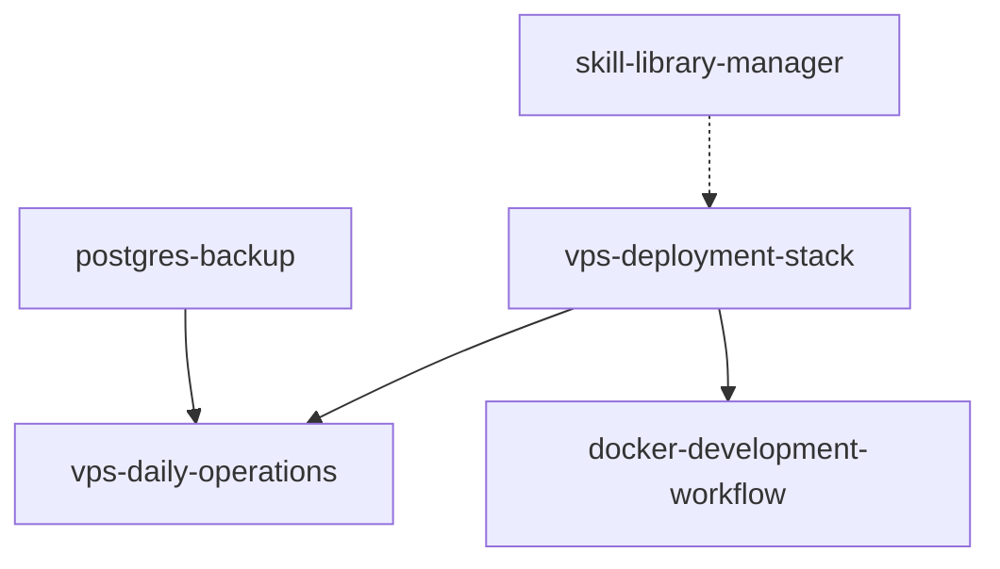

# Skill Dependency Mapper

Visualize and manage skill dependencies and relationships across your library.

## Prerequisites

- Python 3.8+
- Library with skills at `~/Skills_librairie`
- Mermaid CLI (optional): `npm install -g @mermaid-js/mermaid-cli`

## Quick Start

### 1. Build Dependency Graph (1 min)

```bash
python3 scripts/map-dependencies.py ~/Skills_librairie

# Output:
# Dependency Graph Generated
# Total skills: 12
# Dependencies found: 8
# Circular dependencies: 0
# Orphaned skills: 2
```

### 2. Visualize Graph (2 min)

```bash
# Generate Mermaid diagram
python3 scripts/map-dependencies.py ~/Skills_librairie --diagram

# Creates: dependency-graph.mmd
```

**Example diagram:**


### 3. Get Recommendations (5 min)

```bash
python3 scripts/map-dependencies.py ~/Skills_librairie --recommendations

# Suggestions:
# 1. Consider splitting "vps-deployment-stack" (3000 tokens)
#    → vps-base-infrastructure
#    → vps-monitoring-setup
# 
# 2. Create "backup-foundation" skill
#    Shared by: postgres-backup, mysql-backup, redis-backup
# 
# 3. Orphaned skill: legacy-docker-compose
#    No dependencies, not depended on
#    Action: Archive or promote
```

## Dependency Detection

### Explicit Dependencies

From frontmatter:
```yaml
---
dependencies: [vps-deployment-stack, docker-workflow]
---
```

### Implicit Dependencies

From content analysis:
```markdown
# In SKILL.md:
See **vps-deployment-stack** for infrastructure setup.
This builds on **docker-workflow** concepts.
```

Detected by:
- Skill name mentions
- File path references
- Shared scripts/references

## Outputs

### 1. Dependency List

```
vps-deployment-stack
  └─> (no dependencies)

vps-daily-operations
  └─> vps-deployment-stack

docker-development-workflow
  └─> vps-deployment-stack

postgres-backup
  └─> vps-daily-operations
      └─> vps-deployment-stack

Depth analysis:
- Level 0 (foundation): 1 skill
- Level 1: 2 skills
- Level 2: 1 skill
```

### 2. Reverse Dependencies

```
Who depends on vps-deployment-stack?
  - vps-daily-operations
  - docker-development-workflow
  - postgres-backup (indirect)

Impact score: HIGH (3 direct + 1 indirect dependents)
Breaking changes would affect 4 skills
```

### 3. Circular Dependency Detection

```
WARNING: Circular dependency found!

skill-A → skill-B → skill-C → skill-A

This creates maintenance issues.

Recommendation:
Extract shared functionality into skill-D
```

### 4. Skill Families

```
VPS Family (4 skills):
- vps-deployment-stack (foundation)
- vps-daily-operations
- vps-monitoring
- vps-security-hardening

Backup Family (3 skills):
- postgres-backup
- mysql-backup
- redis-backup
Suggestion: Create "backup-common" base skill
```

## Analysis Features

### Complexity Score

```
Skill: vps-deployment-stack
Complexity: 7/10

Factors:
- Token count: 8,500 (high)
- Dependencies: 0 (low)
- Dependents: 3 (medium-high)
- Sections: 12 (high)
- Scripts: 5 (medium)

Recommendation: Consider splitting
```

### Reuse Opportunities

```
Common patterns detected:

Pattern: Backup to S3
Used in:
- postgres-backup (scripts/s3-upload.sh)
- mysql-backup (scripts/upload-s3.sh)
- redis-backup (scripts/backup-to-s3.sh)

Recommendation:
Create "s3-backup-helper" skill
Extract common S3 logic
Reduce duplication by 60%
```

### Composition Suggestions

```
You have 3 skills for database monitoring:
- postgres-monitoring
- mysql-monitoring
- redis-monitoring

Suggestion: Compose into "database-monitoring"
Sections:
- PostgreSQL (from postgres-monitoring)
- MySQL (from mysql-monitoring)
- Redis (from redis-monitoring)
- Common monitoring patterns (new)

Benefits:
- Single skill for DB monitoring
- Consistent patterns
- Easier maintenance
```

## Commands

```bash
# Basic dependency map
python3 scripts/map-dependencies.py ~/Skills_librairie

# Generate Mermaid diagram
python3 scripts/map-dependencies.py ~/Skills_librairie --diagram --output graph.mmd

# Check specific skill
python3 scripts/map-dependencies.py ~/Skills_librairie --skill postgres-backup

# Find impact of changes
python3 scripts/map-dependencies.py ~/Skills_librairie --impact vps-deployment-stack

# Suggest refactoring
python3 scripts/map-dependencies.py ~/Skills_librairie --recommendations

# Export to JSON
python3 scripts/map-dependencies.py ~/Skills_librairie --json > deps.json
```

## Integration

### Pre-commit Hook

```bash
# .git/hooks/pre-commit
# Check for new circular dependencies

python3 scripts/map-dependencies.py . --check-circular || {
    echo "Error: Circular dependency detected!"
    exit 1
}
```

### CI/CD

```yaml
- name: Check Dependencies
  run: |
    python3 scripts/map-dependencies.py . --check-circular
    python3 scripts/map-dependencies.py . --recommendations > analysis.txt
    
- name: Upload Analysis
  uses: actions/upload-artifact@v3
  with:
    name: dependency-analysis
    path: analysis.txt
```

## Reference Files

- **scripts/map-dependencies.py** - Main dependency mapper
- **scripts/visualize-graph.py** - Generate diagrams
- **references/refactoring-patterns.md** - Common refactoring strategies
- **assets/graph-template.mmd** - Mermaid diagram template

## Related Skills

- **skill-quality-auditor** - Quality metrics for splitting decisions
- **skill-library-manager** - Manage dependencies in catalog
- **skill-code-simplifier** - Simplify complex skills
